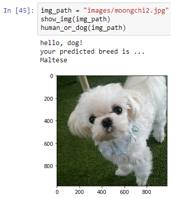
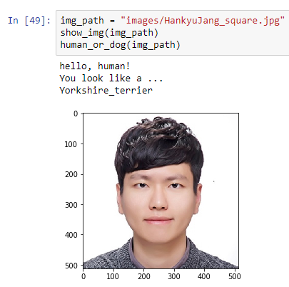
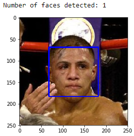

# [Deep Learning] Dog Breed Classification

- Hardware: GPU([cuDNN](https://developer.nvidia.com/cudnn)) - AWS EC2 Deep Learning AMI with Source Code (CUDA 8, Ubuntu)
- Software: Keras, Tensorflow, OpenCV, Numpy, Matplotlib, Python

In this project, I first implemented a dog breed classifier from scratch using Convolutional Neural Networks. The summary of the CNN model is shown below. It attained over __19%__ accuracy in classifying dogs into 133 categories. The accuracy is not promising, but compared to the random classifier (less than 1% accuracy), the model is working in some level.

Then, I utilized pre-trained CNN models to get better working models. I fixed the weights of the networks upto the final layer. Then I added Global Average Pooling layer to reduce the total parameters, and then added the dense layer to have 133 output nodes (corresponding to the number of dog breeds). I only trained the last two layers for 20 epochs with batch size of 20. As the result, `VGG16` model produced the test accuracy of around __49%__ and `Resnet50` model produced the test accuracy of around __79%__ which was a dramatic increased compared to my previous model.

I used the 'transfer learning - `Resnet50` model' to implement an algorithm for a Dog identification application. The user provides an image, and the algorithm first detects whether the image is human or dog. If it is a dog, it predicts the breed. If it is a human, it returns the resembling dog breed. Here are examples of the algorithms:

Example 1: An image of Maltese



Example 2: An image of human (me)



## Dataset

In this project, I used dog dataset, human dataset, and a bottleneck features of dog images trained on pre-trained models for Keras that are [VGG-16](https://www.kaggle.com/keras/vgg16) and [ResNet50](https://keras.io/applications/#resnet50)

Here are the datasets used in this project:

- [Dog Dataset](https://s3-us-west-1.amazonaws.com/udacity-aind/dog-project/dogImages.zip)
- [Human Dataset](https://s3-us-west-1.amazonaws.com/udacity-aind/dog-project/lfw.zip)
- [VGG-16 bottleneck features](https://s3-us-west-1.amazonaws.com/udacity-aind/dog-project/DogVGG16Data.npz)
- [ResNet50 bottleneck features](https://s3-us-west-1.amazonaws.com/udacity-aind/dog-project/DogResnet50Data.npz)

## Step 1: Detect Humans

I used OpenCV's implementation of [Haar feature-based cascade classifiers](http://docs.opencv.org/trunk/d7/d8b/tutorial_py_face_detection.html) to detect human faces in image. 



## Step 2: Detect Dogs

I used a pre-trained `ResNet-50` model to detect dogs. The model is trained on ImageNet which links over 10 million URLs to one of the 1000 categories. Amongst the 1000 categories, dogs appear in dictionary keys 151 (Chihuahua) to 268 (Mexican hairless). Using this information, I first classify an image using the `ResNet-50` model and checked if the predicted label is in the range 151 - 268.

### Pre processing

1. Convert images to 4D array `(number of samples, rows, cols, channels)`
Keras CNNs require a 4D array when using TensorFlow as backend
2. Resize images to 224 X 224.

## Step 3: CNN from Scratch

### Pre processing

1. Rescale the images by dividing each pixel by 255.

From my understanding of Convolutional layers, each layer seems to detect different aspects in images. For instance, first convolutional layer detects edges or blobs of colors, the second layer detects circles, stripes and rectangles which are general features used to analyze any image in any data set. The third and fourth convolutional layer detects some specific features in the image that could distinguish which object is in the image. Finally, the fifth convolutional layer may be able to pick out highest order ideas that could be used to detect the breed of the specific dog.

I designed the CNN architecture based on the above reasoning. I also added the global average pooling layer to reduce the number of parameters to be trained. I trained the model for 100 epochs with batch size of 20. I used the checkpointer that saves the best model that have the lowest validation loss. I saved the best model as `weights.best.from_scratch.hdf5` in `saved_models` directory.
```
_________________________________________________________________
Layer (type)                 Output Shape              Param #   
=================================================================
conv2d_1 (Conv2D)            (None, 223, 223, 16)      208       
_________________________________________________________________
max_pooling2d_2 (MaxPooling2 (None, 111, 111, 16)      0         
_________________________________________________________________
conv2d_2 (Conv2D)            (None, 110, 110, 32)      2080      
_________________________________________________________________
max_pooling2d_3 (MaxPooling2 (None, 55, 55, 32)        0         
_________________________________________________________________
conv2d_3 (Conv2D)            (None, 54, 54, 64)        8256      
_________________________________________________________________
max_pooling2d_4 (MaxPooling2 (None, 27, 27, 64)        0         
_________________________________________________________________
conv2d_4 (Conv2D)            (None, 26, 26, 64)        16448     
_________________________________________________________________
max_pooling2d_5 (MaxPooling2 (None, 13, 13, 64)        0         
_________________________________________________________________
conv2d_5 (Conv2D)            (None, 12, 12, 64)        16448     
_________________________________________________________________
max_pooling2d_6 (MaxPooling2 (None, 6, 6, 64)          0         
_________________________________________________________________
global_average_pooling2d_1 ( (None, 64)                0         
_________________________________________________________________
dense_1 (Dense)              (None, 133)               8645      
=================================================================
Total params: 52,085
Trainable params: 52,085
Non-trainable params: 0
_________________________________________________________________
```

## Step 4: Transfer Learning

As explained in the beginning, I only trained the weights on the last two layers that are global average pooling layer and the dense layer. To make this simple, I used bottleneck features for each model. Here, bottleneck features represent the output values of the input image after going through the trained CNN and stopped before the dense layer. 

`VGG16` model: __49%__ accuracy
```
_________________________________________________________________
Layer (type)                 Output Shape              Param #   
=================================================================
global_average_pooling2d_2 ( (None, 512)               0         
_________________________________________________________________
dense_2 (Dense)              (None, 133)               68229     
=================================================================
Total params: 68,229
Trainable params: 68,229
Non-trainable params: 0
_________________________________________________________________
```

`Resnet50` model: __79%__ 
```
_________________________________________________________________
Layer (type)                 Output Shape              Param #   
=================================================================
global_average_pooling2d_3 ( (None, 2048)              0         
_________________________________________________________________
dense_3 (Dense)              (None, 133)               272517    
=================================================================
Total params: 272,517
Trainable params: 272,517
Non-trainable params: 0
_________________________________________________________________
```

## Possible improvements

Here are some possible points of improvement for my algorithm: 

1) face_detector: In the function `human_or_dog` I declared above, I checked whether the given image is dog first. The reason is because it had better accuracy compared to that of `face_detector`. If I change the order of `face_detector` and `dog_detector`, I got a higher error rate in detecting some dog images as human. Hence, I can further improve the algorithm by improving `face_detector` with a deep learning model.

2) Instead of using Global Average Pooling, I can use Max Pooling. In this way, there would be much more parameters to train, but may give better accuracy in classifying dog breed.

3) Whenever the model fails to detect the breed of the dog, I can add that image and train the model again. In this way, the model will detect the breed of the dog better and better as more images are tested. However, the breed of the dog must be a ground truth because people might give fake images or purposedly provide different label to degrade the model.

4) Voting: I can make five independent models with `VGG16`, `VGG19`, `Resnet50`, `InceptionV3`, and `Xception`. Then, when testing the image, I can take vote from the five predictions the different model gives. The breed that gets the majority vote will be the predicted breed.

## Reference

- Udacity dog-project: [link](https://github.com/udacity/dog-project)
